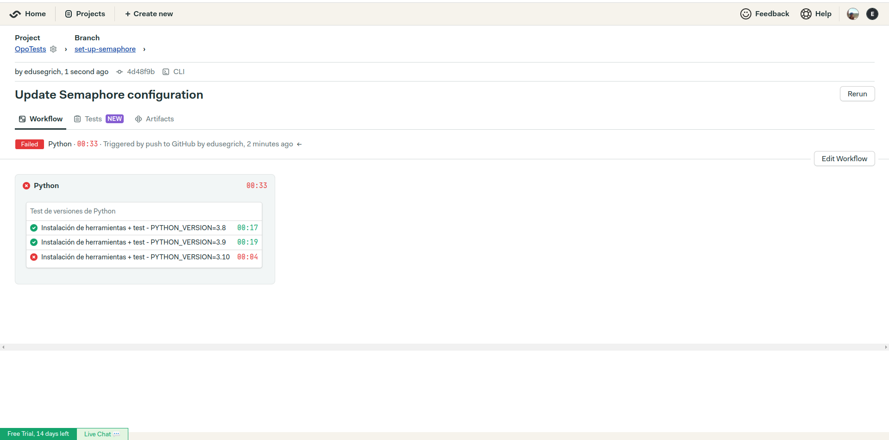
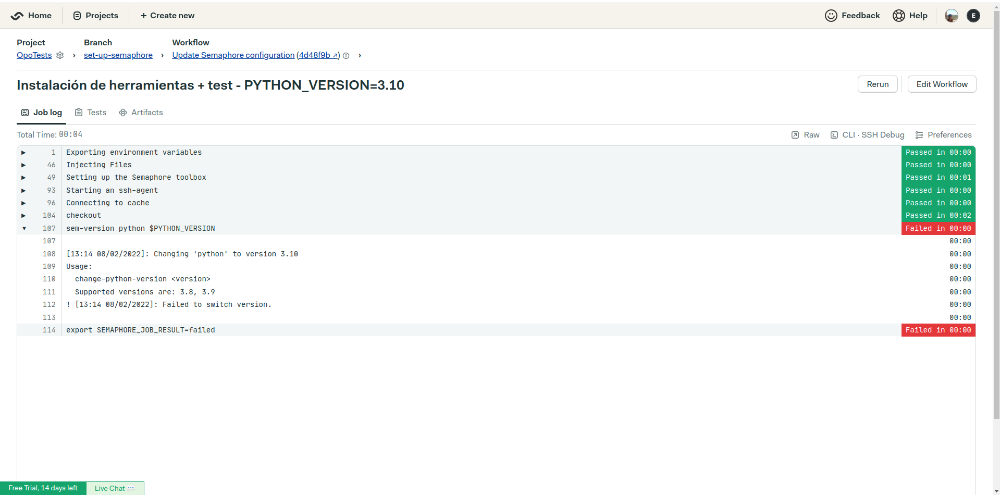
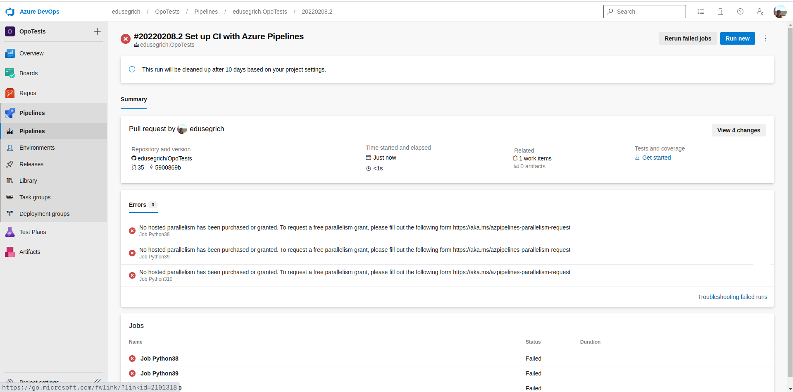
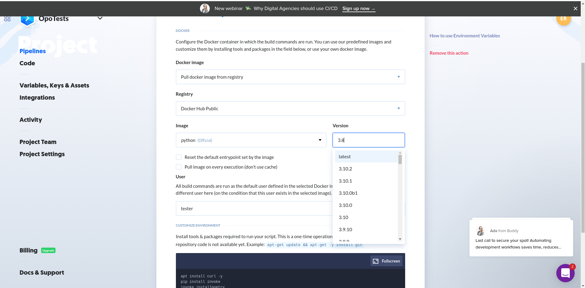

# Versiones de Python a testear
Actualmente existen varias versiones de Python que están recibiendo soporte por parte de los desarrolladores y se están publicando versiones, tanto parches que solucionan bugs como parches de actualizaciones de seguridad. Estas versiones son:
- `python3.8`: a día de hoy, su desarrollo está terminado y las [publicaciones](https://www.python.org/dev/peps/pep-0569/) para corregir bugs y de seguridad que había planificadas ya han sido publicadas, aunque seguirá recibiendo de estas últimas conforme vaya siendo oportuno hasta el año 2024. Esta ha sido la versión con la que se ha realizado el desarrollo del proyecto y, por tanto, será testeada.
- `python3.9`: también ha terminado su desarrollo ([PEP 596](https://www.python.org/dev/peps/pep-0596/)). Sin embargo, esta versión todavía está pendiente de tener dos publicaciones de corrección de parches, esperándose esta última para mayo de 2022. También se publicarán actualizaciones de seguridad conforme sea necesario, pero en este caso será hasta 2025. Por lo tanto, esta versión también será testeada.
- `python3.10`: esta versión publicó su última versión de desarrollo en octubre de 2021 y tiene todavía bastantes publicaciones de corrección de bugs previstas para el futuro ([PEP 619](https://www.python.org/dev/peps/pep-0619/)). Se estima que seguirá recibiendo soporte hasta octubre de 2026. Esta también será testeada.
- `python3.11`: esta versión actualmente se encuentra en desarrollo ([PEP 664](https://www.python.org/dev/peps/pep-0664/)) y se prevee que terminará a finales de 2022, habiendo bastantes publicaciones planificadas hasta entonces. Por tanto, no se va a testear esta versión todavía en desarrollo.

# Sistema de Integración Continua
## Requisitos del Sistema CI
Para buscar un sistema de integración continua se han establecidos una serie de criterios con los que filtrar las opciones que hay disponibles. Los criterios que se han establecido son:
- Uso desde la nube.
- Servicio gratuito.
- Integración con GitHub.
- Compatible con las versiones de Python elegidas.
- Uso sencillo de aprender.

## Opciones
Teniendo en cuenta los requisitos establecidos, se ha realizado una búsqueda de distintas opciones entre las que están:
- [**Semaphore CI**](https://semaphoreci.com/).
- [**Azure Pipelines**](https://azure.microsoft.com/es-es/services/devops/pipelines/).
- [**Travis CI**](https://travis-ci.org/).
- [**GitHub Actions**](https://github.com/features/actions).
- [~~**Circle CI**~~](https://circleci.com) (Descartada por uso frecuente en la asignatura).

## Análisis de las opciones
### Semaphore CI
Cuando fui a registrarme en el sistema de Semaphore CI con mi cuenta de GitHub no se me permitió, alegando que se me había bloqueado el acceso debido a *Abuse Prevent*. Al día siguiente recibí un correo en el que me comunicaban que habían desbloqueado mi cuenta y estaba disponible mi registro. Tras ello, el registro es realmente fácil y está totalmente integrado con GitHub. Indiqué mi perfil y concecté el acceso a mi contenido de GitHub.

Una vez listo el registro y la puesta a punto de mi cuenta, comencé a utilizar el sistema de Semaphore CI. Me ha llamado bastante la atención su interfaz, pues es posible diseñar nuestro workflow tanto editando un fichero '.yaml' de la manera convencional como haciendo uso de una interfaz gráfica en la que se definen los bloques y los trabajos con ayuda de una especie de diagrama, al que llaman *Visual Builder*.

Después de probar su funcionamiento me dispuse a implementar el workflow con el que testear el proyecto con distintas versiones de Python. Utilizando una matrix comprobé que Semaphore CI no tiene disponible la versión 3.10 de Python, ni para [máquinas virtuales](https://docs.semaphoreci.com/ci-cd-environment/ubuntu-18.04-image/#python) ni para [contenedores de Docker](https://docs.semaphoreci.com/ci-cd-environment/semaphore-registry-images/#python). A pesar de ello, los tests en la versión 3.8 y 3.9 pasaron con éxito.

- Dispone de uso desde la nube. ✔️
- El servicio no es gratuito pero proporciona una prueba de 14 días. ✔️
- Tiene integración con GitHub. ✔️
- No es compatible con `python3.10`. :x:
- Es fácil de aprender y tiene buena [documentación](https://docs.semaphoreci.com/). ✔️

### Azure Pipelines
Microsoft ofrece un servicio de Integración Continua llamado **Azure DevOps**. En él se puede hacer uso de *pipelines* con los que definir workflows para nuestro proyecto.

El registro en este sistema es similar al descrito con Semaphore CI ya que cuenta con integración con GitHub y podemos acceder a nuestros proyectos directamente.

Al comenzar a desarrollar el workflow, me ha llamado la atención la facilidad con la que lo he podido diseñar ya que el propio sistema te pregunta el lenguaje de programación con el que se está desarrollando el pryecto y te sugiere hacer un workflow para la comprobación del funcionamiento con distintas versiones, ofreciéndote una plantilla que prácticamente solo hay que rellenarla con nuestras necesidades (instalación de gestores de tareas y dependencias).

Al ejecutar los tests se ha producido un error en el que indica que se requieren privilegios del host para ejecutar el código con paralelismo. Para poder solicitar dichos privilegios es necesario rellenar y enviar un formulario. A pesar de mandar los datos solicitados en el formulario, no hay ningún tipo de *feedback* por parte de la plataforma.

Las conclusiones después de su uso son:
- Dispone de uso desde la nube. ✔️
- El servicio es gratuito para repositorios públicos. ✔️
- Tiene integración con GitHub. ✔️
- Disponibilidad de las versiones de python. ✔️
- No se ha podido utilizar de forma correcta debido a la restricción de uso comentada anteriormente. :x:

### Travis CI
Travis CI es un sistema de Integración Continua de pago. Cuenta con una prueba gratuita de 1 mes pero es necesario registrar los datos bancarios y se ha optado por omitir su prueba.

### Buddy
Buddy es un sistema de Integración Continua bastante distinto a los ya comentados. En este sistema no se configura un fichero '.yaml' directamente, sino que a través de una interfaz gráfica se van ajustando los parámetros en base al workflow que deseamos.

Su uso es desde la nube, es gratuito y tiene integración con GitHub. Además, cuenta con un gran número de versiones de python.

Después de haber probado otros sistemas CI, este me ha parecido poco intuitivo (no sé si por esperarme la configuración típica en un fichero) y se me ha hecho complicado de entender su funcionamiento.
- Dispone de uso desde la nube. ✔️
- El servicio es gratuito. ✔️
- Tiene integración con GitHub. ✔️
- Disponibilidad de las versiones de python. ✔️
- Su uso me ha parecido un tanto complicado y poco intuitivo. :x:

### GitHub Actions
GitHub Actions es un sistema que ya conocemos tras haberlo utilizado en el objetivo anterior con el fin de mantener nuestro contenedor para pruebas actualizado en DockerHub. Es un CI realmente interesante y, en mi opinión, muy bien implementado. El hecho de que esté totalmente integrado en GitHub me parece que le aporta una enorme ventaja sobre los demás. Su uso es fácil de entender y la [documentación](https://docs.github.com/en/actions) acerca de ello es bastante descriptiva.

No se me hizo difícil aprender a desarrollar #33 con GitHub Actions en el objetivo anterior, por lo que se podría decir que mi pequeña experiencia con su uso es buena.
- Dispone de uso desde GitHub. ✔️
- El servicio es gratuito. ✔️
- Totalmente integrado con GitHub. ✔️
- Disponibilidad de las versiones de python. ✔️
- He tenido buena experiencia al utilizarlo. ✔️

## Elección
Después de haber probado varios sistemas de integración continua, he de decir que he descubierto un nuevo mundo de herramientas para el desarrollo software y, el hecho de ser un principiante en ello me ha hecho saber distinguir con facilidad qué opciones me gustan más sobre otras. Por tanto, y enfocando el objetivo que queremos abordar, se ha optado por las siguientes soluciones:
- **GitHub Actions** se utilizará para testear código que se añada al proyecto en `python3.10`.
- **Semaphore CI** se utilizará para testear otras versiones de python (`python3.8` y `python3.9`).
